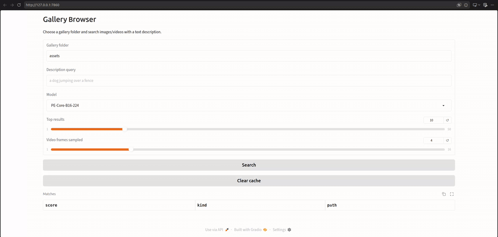

# Gallery Browser

Gallery Browser is a lightweight `uv`-based package for running `perception_models` experiments and testing text-to-media retrieval on local galleries.



## Highlights

- Installable Python package with CLI + browser UI.
- Text-to-image and text-to-video retrieval from a gallery folder.
- Multi-frame video scoring for better video ranking quality.
- Cached gallery embeddings for faster repeated searches.
- Extra PE command support: CLIP, vision checkpoints, PE-AV, PE-A Frame.

## Quickstart

```bash
uv sync
uv run gallery-browser-smoke
```

Launch the UI with sample assets:

```bash
uv run gallery-browser ui --gallery assets
```

Then open the local URL printed in the terminal.

## UI Search Tips

- Start with queries like `a cat`, `a dog in motion`, `people talking in an office`.
- Increase `Video frames sampled` (for example `6` or `8`) for better video retrieval.
- Use `Clear cache` if gallery files change.

## CLI Examples

List available models:

```bash
uv run gallery-browser models --family all
```

Image/text CLIP inference:

```bash
uv run gallery-browser \
  clip \
  --image assets/cat.png \
  --label "a cat" \
  --label "a dog"
```

Video/frame CLIP inference:

```bash
uv run gallery-browser \
  clip \
  --video assets/dog.mp4 \
  --frame-index 0 \
  --label "a dog jumping" \
  --label "an empty room"
```

Vision feature extraction:

```bash
uv run gallery-browser \
  vision \
  --image assets/cat.png \
  --model PE-Lang-L14-448
```

PE-AV embeddings:

```bash
uv run gallery-browser \
  av \
  --video assets/train.mp4 \
  --audio assets/train.mp4 \
  --text "a train moving on tracks"
```

PE-A Frame localization:

```bash
uv run gallery-browser \
  audio-localize \
  --audio assets/office.mp4 \
  --text "a person talking"
```

Clipbench summary:

```bash
uv run gallery-browser clipbench
```

## Notes

- First run downloads model weights from Hugging Face.
- `uv.lock` captures the resolved `perception_models` Git state.
- Default CLIP model is `PE-Core-B16-224`.
- Audio/video fallback paths use internal decord-based transforms when needed.
